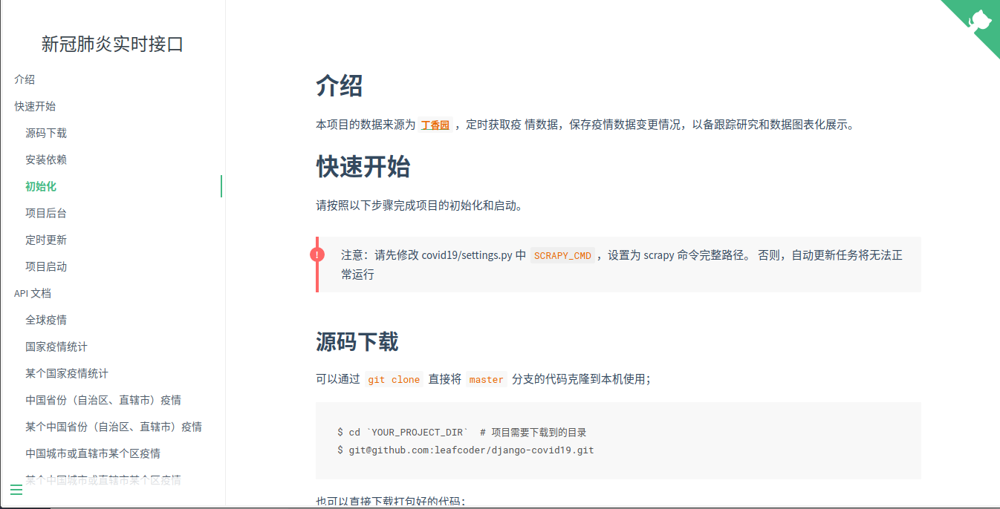

# 新冠肺炎实时接口 {docsify-ignore}

<!-- Place this tag where you want the button to render. -->

# 接口文档

点击查看 [在线接口文档](https://blog.leafcoder.cn/django-covid19/)。

# 在线大屏

点击查看 [在线数据大屏](http://111.231.75.86/dashboard)。

# 文档预览

